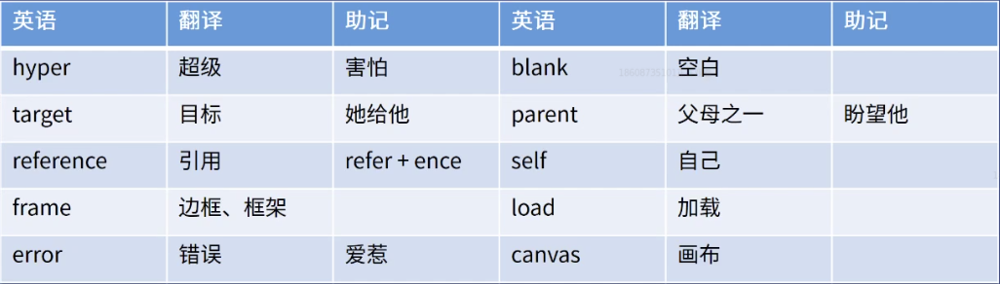

# HTML全解

## HTML概览

### HTML的历史

WWW=URL+HTTP+HTML
1. www万维网的发明  
    1990年Tim Berners-Lee 李爵士
   
2. 如何使用万维网
* 网址
* 网页
* HTTP
  

### HTML语法
HTML5权威资料网站：  
搜索MDN HTML5

1. HTML5的2个含义
* 最新版HTML语言，含有就标签和32个新标签
* HTML5和它的朋友们（包括CSS 3等）
2. HTML5技术合集
* 新标签、新技术
* 新通信技术：WebSockets、WebRTC等
* 离线存储技术：LocalStrorage、断网检测
* 多媒体技术：视频、音频
* 图像技术：Canvas、SVG、WebGL
* Web增强技术：History API、全屏
* 设备相关技术：摄像头、触摸屏
* 新的样式技术：CSS3新的Flex、Grid的布局方式

HTML5标签  
[需要学习标签简介](HTML5全解脑图.mmap)  
```<!DOCTYPE html>```   文件类型  
```<tag attr=value>内容</tag>```  属性的值与命令行一样  
```<tag attr>内容</tag>```   没有值的属性，不而属性  
```<tag attr=value>```  自闭合

细节  
* 大小写无区别
* 有特殊字符必须加引号，若无可加可不加
* 注释```<!--    -->```
  
HTML排错
  * 看VSCode的颜色提示
  * 看WebStorm的颜色提示
  * 使用HTML5验证器（在线/npm工具）
  * Google 关键词后面加MDN可查询语法使用方法
  

  ## HTML标签

  ### 英语小课堂
  

### 学习工具

免费书籍  
* 《网道HTML教程》[免费学习教程](https://wangdoc.com/html/index.html)

VSCode插件推荐
* Prettier 更好的格式化工具
  
代码BUG三要素
* 代码链接
* 期望效果
* 实际效果

如何获取代码链接  
* JS Bin(js.jirengu.com)
* 代码沙河(codesandbox.io)

### HTML起手式
Emmet 感叹号
起手式详解


### 章节标签&全局属性
1. 章节标签
* 标题 h1~h6
* 章节 section
* 文章 article
* 段落 p
* 头部 header
* 脚部 footer
* 主要内容 main
* 旁支内容 aside
* 划分 div
* 版权所有 &copy  
例：

2. 全局属性
* class 赋予名字，添加样式
* contenteditable 界面可编辑
* hidden 隐藏
* id 赋予名字，添加样式（限制太多，不建议使用）
* style 样式
* tabindex 设置Tab键控制网页  
  tabindex=正数 表示顺序
  tabindex=0 表示最后一个
  tabindex=-1 表示别访问我
* title 显示完整内容  
  超出1行字体隐藏并省略:
  ```white-space: nowrap;
      overflow: hidden;
      text-overflow: ellipsis; 

例：

### 默认样式&CSS reset
默认样式指HTML自带样式  
可使用Chrome开发者工具Elements->Styles->user agent stylesheet
CSS reset 指将默认样式清除

### 内容标签
* ol+li 有顺序的列表和内容
* ul+li 没有顺序的列表
* dl+dt+dd 描述列表
* pre 保留空格、回车、Tab
* hr 分割线
* br 换行
* a 超链接
* em 表示强调
* strong 表示重点
* code 字体等宽
* quote 行引用
* blockquote 块引用

## HTML重难点

英语小课堂
  

### a 标签  
属性  
href  是一个超级链接  
target 在哪一个窗口打开链接(targtt="_blank" 在新标签打开)  
download （不是所有浏览器都支持）  
rel=noopener 防止一个bug  
作用：  
* 跳转外部页面
* 跳转内部锚点  
* 跳转到邮箱或者地址

a的href的取值
* 网址  
https://baidu.com  
http://baidu.com  
//google.com
* 路径  
/a/b/c以及a/b/c  
index.html以及./index.html  
* ID  
href=#XXX 跳转一个指定标签
* 伪协议  
javascript:代码；  
mailto:邮箱  
tel:手机号   
a的target的取值
* 内置名字
_blank 空白页面打开  
_top 在最顶层级打开  
_parent 在副层级打开  
_self 默认方式代开  
* 程序员命名  
window的name  
iframe的name  

### iframe标签
内嵌窗口，目前仅有某些老系统使用  

### table标签
表格  
* 相关标签  
table 
thead
tbody
tfoot
tr //table row 表格中的一行  
td  数据  
th 表头  
* 相关样式  
table-layout 表格布局单元格，行和列  
border-collapse 合并  
border-spacing 单元格之间的距离

### img标签
作用：发出get请求，展示一张图片  
属性：alt/height/width/src  
事件：onload/onerror  
响应式：max-width:100%  

### form标签(表单)
作用：发get或post请求，然后刷新页面  
属性：action/autocomplete/method/target  
事件：onsubmit  

### input标签
作用：让用户输入内容  
属性：  
类型type:button/checkbox/email/file/hidden/number/password/radio/search/submit/tel/text  
其他name/autofocus/checked/disabled/maslength/pattern/value/placeholder  
事件：onchange/onfocus/onblur  
验证器：HTML5新增功能

### 其他输入标签
标签：select+option/textarea/label
注意事项：一般不监听input的click事件  
from里面的input要有name  
form里要发放一个type=submit才能出发submit事件

### 其他标签
标签：video/audio/canvas/svg  
注意事项:标签兼容性一定要看文档