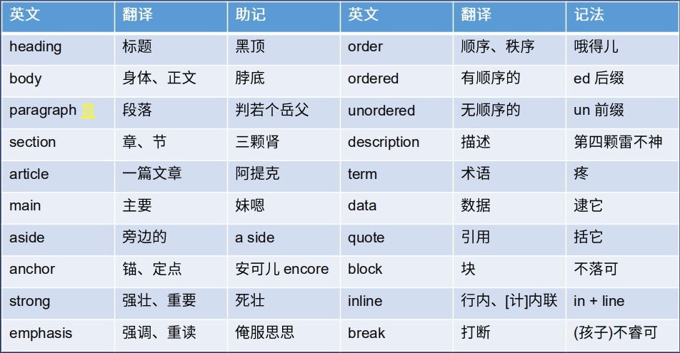
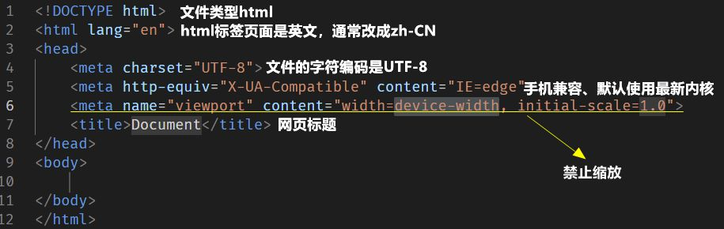
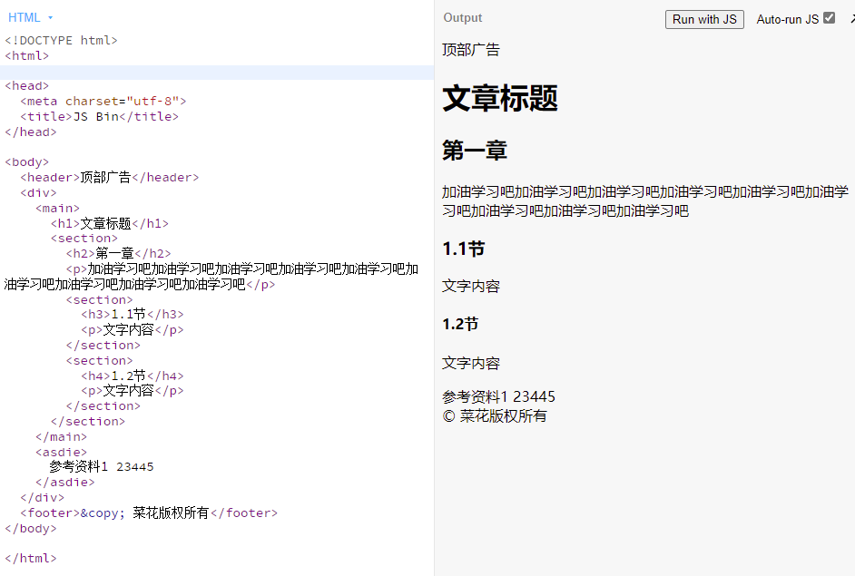
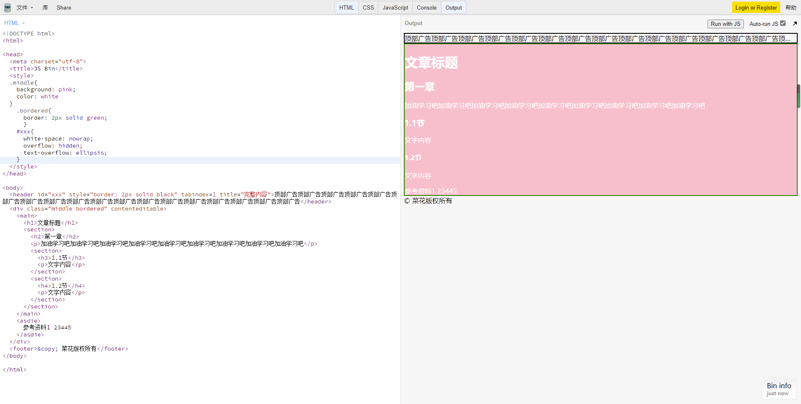

# HTML全解

## HTML概览

### HTML的历史

WWW=URL+HTTP+HTML
1. www万维网的发明  
    1990年Tim Berners-Lee 李爵士
   
2. 如何使用万维网
* 网址
* 网页
* HTTP
  

### HTML语法
HTML5权威资料网站：  
搜索MDN HTML5

1. HTML5的2个含义
* 最新版HTML语言，含有就标签和32个新标签
* HTML5和它的朋友们（包括CSS 3等）
2. HTML5技术合集
* 新标签、新技术
* 新通信技术：WebSockets、WebRTC等
* 离线存储技术：LocalStrorage、断网检测
* 多媒体技术：视频、音频
* 图像技术：Canvas、SVG、WebGL
* Web增强技术：History API、全屏
* 设备相关技术：摄像头、触摸屏
* 新的样式技术：CSS3新的Flex、Grid的布局方式

HTML5标签  
[需要学习标签简介](HTML5全解脑图.mmap)  
```<!DOCTYPE html>```   文件类型  
```<tag attr=value>内容</tag>```  属性的值与命令行一样  
```<tag attr>内容</tag>```   没有值的属性，不而属性  
```<tag attr=value>```  自闭合

细节  
* 大小写无区别
* 有特殊字符必须加引号，若无可加可不加
* 注释```<!--    -->```
  
HTML排错
  * 看VSCode的颜色提示
  * 看WebStorm的颜色提示
  * 使用HTML5验证器（在线/npm工具）
  * Google 关键词后面加MDN可查询语法使用方法
  

  ## HTML标签

  ### 英语小课堂
  

### 学习工具

免费书籍  
* 《网道HTML教程》[免费学习教程](https://wangdoc.com/html/index.html)

VSCode插件推荐
* Prettier 更好的格式化工具
  
代码BUG三要素
* 代码链接
* 期望效果
* 实际效果

如何获取代码链接  
* JS Bin(js.jirengu.com)
* 代码沙河(codesandbox.io)

### HTML起手式
Emmet 感叹号
起手式详解


### 章节标签&全局属性
1. 章节标签
* 标题 h1~h6
* 章节 section
* 文章 article
* 段落 p
* 头部 header
* 脚部 footer
* 主要内容 main
* 旁支内容 aside
* 划分 div
* 版权所有 &copy  
例：

1. 全局属性
* class 赋予名字，添加样式
* contenteditable 界面可编辑
* hidden 隐藏
* id 赋予名字，添加样式（限制太多，不建议使用）
* style 样式
* tabindex 设置Tab键控制网页  
  tabindex=正数 表示顺序
  tabindex=0 表示最后一个
  tabindex=-1 表示别访问我
* title 显示完整内容  
  超出1行字体隐藏并省略
  ```white-space: nowrap;
      overflow: hidden;
      text-overflow: ellipsis; 

例：

### 默认样式&CSS reset
